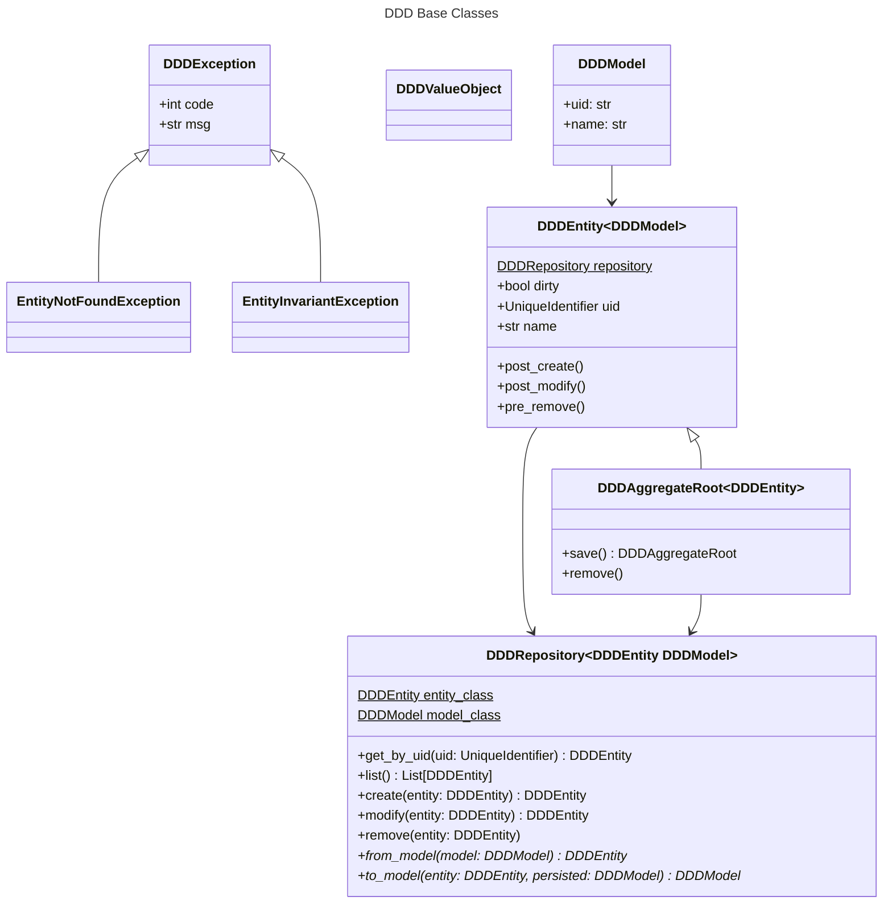
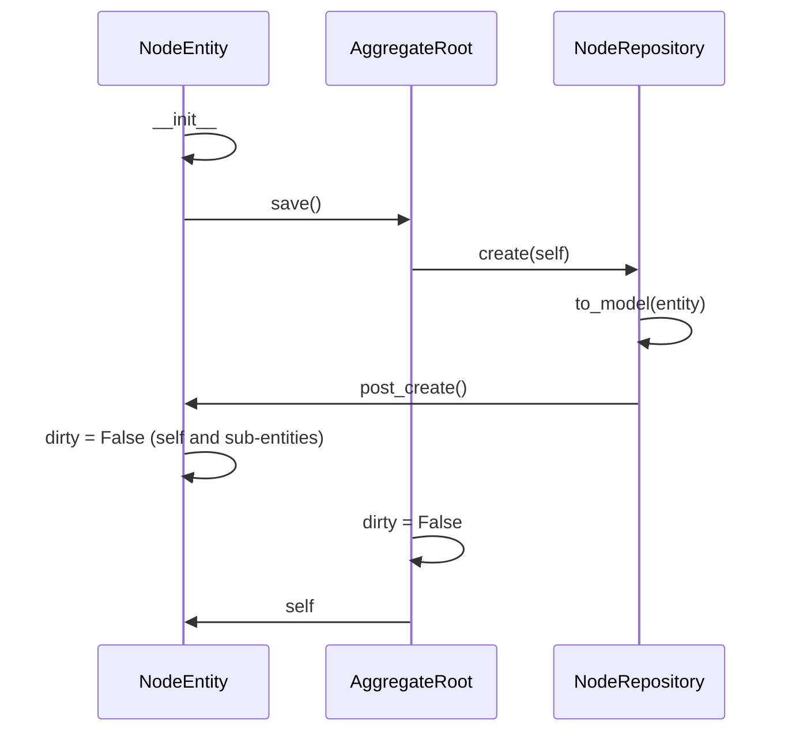

# MrMat :: Hello Python

Python Experiments

[](https://github.com/MrMatAP/mrmat-hello-python/actions/workflows/ci.yml)

## How to use this

This repository holds experiments, reference and little tools that didn't fit anywhere else. Don't expect anything to 
work out of the box.

## How to build this

### Interactively

The project uses the [uv build tool](https://docs.astral.sh/uv/). Install it first, then simply run `uv build --wheel`.

All interactive builds default their version to '0.0.0.dev0', which we use as a marker that this is a locally produced
build which should not go into production. You can override this behaviour by setting the 'MRMAT_VERSION' environment 
variable to the desired version, but doing so is discouraged.

### Continuous Integration

GitHub Actions will trigger builds for pushes and pull requests. A merge push onto the main branch will additionally
create a release.

All builds on branches other than main will have their version calculated from the MAJOR, MINOR and GITHUB_RUN_NUMBER 
environment variables with a '.dev0' suffix appended. You can set the MAJOR and MINOR variables in 
`.github/workflows/build.yml`. Builds resulting from a merge push onto the main branch will not have a suffix.

The resulting code is aware of its version at build-time via the extra `src/ci` module, which is explicitly excluded from
the distribution. Pythons own `importlib.metadata` is then used to make the version available at runtime.

## How to hack on this

### DDD

This is a study on [Domain-driven Design](https://en.wikipedia.org/wiki/Domain-driven_design). Purists will not like it.



A few principles:

* DDDModel declares the persistence model for SQLAlchemy. All models have a uid and a name.
* DDDRepository is the interface between the persistence layer and the DDDEntity. This is where domain operations happen. Type erasure and the behaviour of SQLAlchemy require that we store the DDDModel class as a static class variable, which is easiest to do right in the subclass of DDDRepository. All DDDRepository implementations require `from_model` and `to_model` which transform the entity into its model and vice versa. The abstract implementation of to_model will refresh a new model from the persistence layer when an existing entity is modified and pass it on as the `persisted` parameter to downstream implementations. `persisted` will be None for entities that are created for the first time.
* DDDEntities are meant to be subclassed. They maintain a tie to their repository via the `repository` static class variable. Since this requires to be an initialised object, it cannot be statically set when the DDDEntity subclass is declared. It is set on the entity class by the `__init__` of the corresponding DDDRepository instead.
* DDDAggregateRoots support `save()` and `remove()`.



### Localisation

We use [Babel](https://babel.pocoo.org/en/latest/index.html) **at build-time** to localise Python modules and apps.

1. Within the Python code refer to localised strings via Python gettext's '_' function
2. Use `pybabel` to extract these strings into a '.pot' template file

```shell
$ mkdir src/mhpython/localised/locale
$ pybabel -o src/mhpython/localised/locale/messages.pot --msgid-bugs-address=imfeldma+9jqerw@gmail.com 
--copyright-holder="Mathieu Imfeld" --project=mhpython src/mhpython/localised
```

3. Initialise new languages and translate the resulting '.po' files

```shell
$ pybabel init -i src/mhpython/localised/locale/messages.pot -d src/mhpython/localised/locale -l en
$ pybabel init -i src/mhpython/localised/locale/messages.pot -d src/mhpython/localised/locale -l de
$ pybabel init -i src/mhpython/localised/locale/messages.pot -d src/mhpython/localised/locale -l fr
```

4. Compile the '.po' sources into binary '.mo'

```shell
$ pybabel compile -d src/mhpython/localised/locale --statistics
```

>You could dynamically compile the translations at build-time, but they're small and I find it okay to check them in as 
> binary. **Be sure to specify namespaces = true in pyproject.toml** so the build actually finds the .mo files.

### Fullscreen UI

The fullscreen UI demonstrates how to make a fullscreen (yet non-interactive) UI with some concurrency features.

### Finance

There are two scripts in the `mhpython.finance` module: csv_parser.py which imports a standard CSV into a local database
and pdf_parser.py which uses a local LLM to extract the data from a PDF. The PDF parser is surprisingly clever but fails
on transactions that have empty space for either Gutschrift or Belastung. There appears to be no good way to semantically
parse the PDF. The CSV parser works well.
