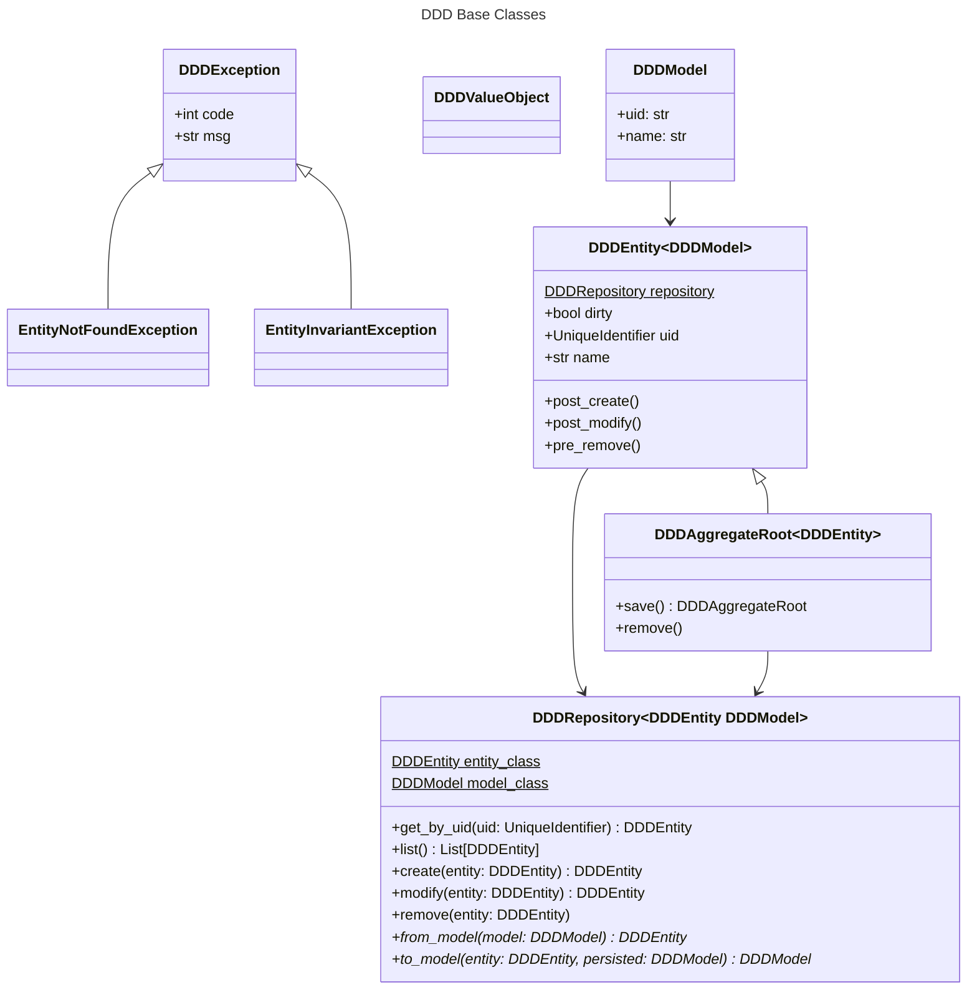
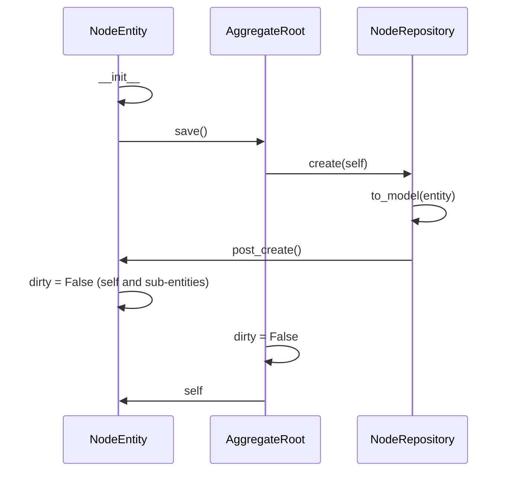

# MrMat :: Hello Python

Python Experiments

[](https://github.com/MrMatAP/mrmat-hello-python/actions/workflows/build.yml)
[](https://github.com/MrMatAP/mrmat-hello-python/actions/workflows/codeql.yml)

## How to use this

This repository serves as a demonstration on how to get a Python project on its feet. There is currently nothing truly
functional demonstrated except for a reasonable CI process as well as tests for a number of Python features.

## How to build this

### Interactively

The general sequence for building interactively is as follows. If you intend to develop on the package, then also
install `requirements.txt`. The runtime dependencies would otherwise only get installed during the installation of the
package that was build.

```$shell
$ pip install -r ./requirements.dev.txt
$ PYTHONPATH=$(pwd)/src python -m build -n --wheel

# Install the runtime dependencies if you intend to change code
$ pip install -r ./requirements.txt
```

> Modifying the PYTHONPATH is necessary so the dynamic version in src/ci can be found during the build process

An interactive build will default to '0.0.0.dev0' for its version, which is a relevant marker showcasing that it was 
produced locally and therefore should not be considered to have sufficient maturity to enter production. It is possible 
to override this behaviour by setting the 'MRMAT_VERSION' environment variable to whatever version is desired but 
clearly doing so is discouraged.

### As part of a CI build

GitHub Actions will trigger a build upon a push and as part of a pull request. If the build is the result of a merge 
onto the merge branch then it is considered to be a release build which will cause a tag to be created. The version is 
suffixed with '.dev0' for any non-release build.

The build version is relayed via the 'MRMAT_VERSION' environment variable from the 'MAJOR', 'MINOR' operational 
variables as well as the 'GITHUB_RUN_NUMBER'. 'MAJOR' and 'MINOR' are meant to be adjusted manually because those are 
conscious version bumps that are expected to happen far less frequently than individual builds. The 'GITHUB_RUN_NUMBER' 
is injected by GitHub Actions itself, resulting in a discrete version of the product for each build.

The version constructed at build time is relayed by using a Python module in `src/ci`, which is referred to by 
`pyproject.toml` and explicitly excluded from the resulting distribution. Pythons `importlib.metadata` is then used
in the top-level `__init__.py` for relaying the version into the runtime.

## How to hack on this

### DDD

This is a study on [Domain-driven Design](https://en.wikipedia.org/wiki/Domain-driven_design). I am aware that this here
is not a pure implementation.



A few principles:

* DDDModel declares the persistence model for SQLAlchemy. All models have a uid and a name.
* DDDRepository is the interface between the persistence layer and the DDDEntity. This is where domain operations happen. Type erasure and the behaviour of SQLAlchemy require that we store the DDDModel class as a static class variable, which is easiest to do right in the subclass of DDDRepository. All DDDRepository implementations require `from_model` and `to_model` which transform the entity into its model and vice versa. The abstract implementation of to_model will refresh a new model from the persistence layer when an existing entity is modified and pass it on as the `persisted` parameter to downstream implementations. `persisted` will be None for entities that are created for the first time.
* DDDEntities are meant to be subclassed. They maintain a tie to their repository via the `repository` static class variable. Since this requires to be an initialised object, it cannot be statically set when the DDDEntity subclass is declared. It is set on the entity class by the `__init__` of the corresponding DDDRepository instead.
* DDDAggregateRoots support `save()` and `remove()`.



### Localisation

We use [Babel](https://babel.pocoo.org/en/latest/index.html) **at build-time** to localise Python modules and apps.

1. Within the Python code refer to localised strings via Python gettext's '_' function
2. Use `pybabel` to extract these strings into a '.pot' template file

```shell
$ mkdir src/mhpython/localised/locale
$ pybabel -o src/mhpython/localised/locale/messages.pot --msgid-bugs-address=imfeldma+9jqerw@gmail.com 
--copyright-holder="Mathieu Imfeld" --project=mhpython src/mhpython/localised
```

3. Initialise new languages and translate the resulting '.po' files

```shell
$ pybabel init -i src/mhpython/localised/locale/messages.pot -d src/mhpython/localised/locale -l en
$ pybabel init -i src/mhpython/localised/locale/messages.pot -d src/mhpython/localised/locale -l de
$ pybabel init -i src/mhpython/localised/locale/messages.pot -d src/mhpython/localised/locale -l fr
```

4. Compile the '.po' sources into binary '.mo'

```shell
$ pybabel compile -d src/mhpython/localised/locale --statistics
```

>You could dynamically compile the translations at build-time, but they're small and I find it okay to check them in as 
> binary. **Be sure to specify namespaces = true in pyproject.toml** so the build actually finds the .mo files.

### Fullscreen UI

The fullscreen UI demonstrates how to make a fullscreen (yet non-interactive) UI with some concurrency features.

### SAST

SAST is provided by CodeQL straight in the main `.github/workflows/codeql.yml` workflow.
